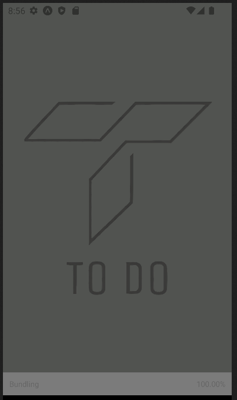
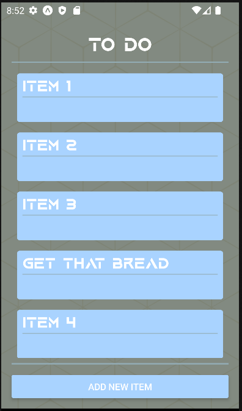
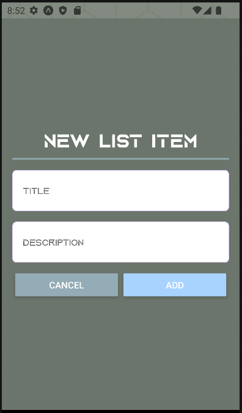
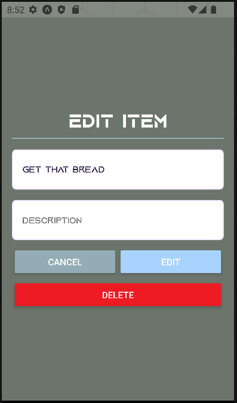

# To Do App

A To Do List App using React Native to create applications that can run on Android, IOS, and on the WEB. This app allows the user to create multiple notes easily and quickly, as well as have it saved to your phone's local storage. Made using the EXPO framework for ease of development and testing. Used React, HTML, CSS, JSX, and Javascript.

# Dependencies

- @react-native-async-storage/async-storage: ^1.17.10,
- expo: ~46.0.16,
- expo-app-loading: ^2.1.0,
- expo-font: ^10.2.1,
- expo-status-bar: ~1.4.0,
- react-native: 0.69.6,
- expo-splash-screen: ~0.16.2

# Screenshots

# Getting Started

1. Clone the repository to your local system
2. Install dependencies: `npm i`
3. Can run this app through your phone or with Android Studio Virtual Devices
4. Install EXPO Go if you are using your physical device, no need to install anything if using the virtual device
5. Run the server: `npm run android`
6. Use your phone to take a picture of the QR code with the EXPO GO app
7. The EXPO Go app will bring you to the to do list app

# RoadMap

- create multiple lists
- support pictures
- be able to use the phone's camera
- support audio
- recording voice clips from the phone
- option to save notes to a database
- setup user sign up and user authentication
